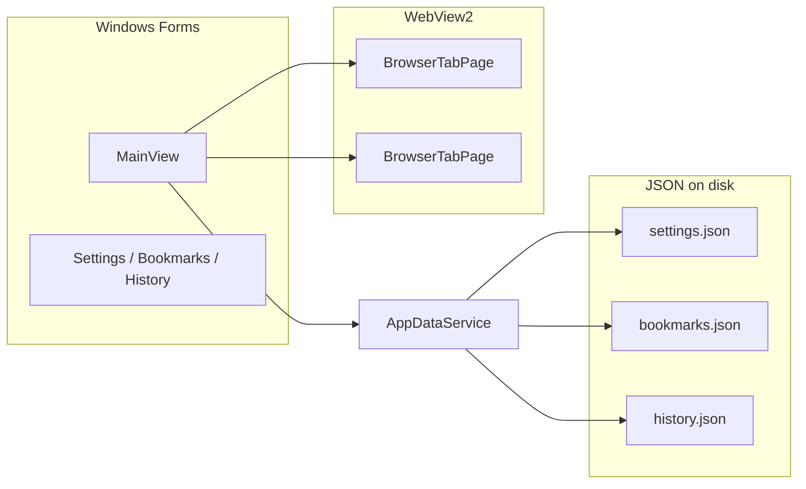

# Portfolio Browser

Десктопный веб-браузер для Windows на **.NET 8** и **Microsoft WebView2** (движок Chromium). Проект из портфолио: полноценный UI с вкладками, закладками, историей и сохранением сессии.

## Возможности

| Категория | Описание |
|-----------|----------|
| **Вкладки** | Несколько вкладок, `Ctrl+T` / `Ctrl+W`, закрытие средней кнопкой мыши |
| **Навигация** | Назад, вперёд, обновить, остановить, домой |
| **Адресная строка** | URL, `site.com` без `https://`, поиск по шаблону (Google по умолчанию) |
| **Закладки** | Добавление (`Ctrl+D`), менеджер, панель быстрых ссылок |
| **История** | До 5000 записей, поиск, `Ctrl+H` |
| **Загрузки** | Сохранение в выбранную папку, уведомление по завершении |
| **Сессия** | Восстановление вкладок при запуске (настраивается) |
| **Инкогнито** | Отдельный профиль WebView2 без смешивания с обычным |
| **DevTools** | `F12` — инструменты разработчика Chromium |
| **Масштаб** | `Ctrl+` / `Ctrl-` / `Ctrl+0` |
| **Интерфейс** | Светлая тема с высоким контрастом, русскоязычное меню |

## Технологии

- **C# 12** / **.NET 8** (`net8.0-windows`)
- **Windows Forms** — нативный UI
- **[WebView2](https://developer.microsoft.com/microsoft-edge/webview2/)** — рендеринг страниц
- **System.Text.Json** — настройки, закладки, история

## Требования

- Windows 10/11 (x64)
- [.NET 8 SDK](https://dotnet.microsoft.com/download/dotnet/8.0)
- [WebView2 Runtime](https://developer.microsoft.com/microsoft-edge/webview2/) (Evergreen) — обычно уже установлен вместе с Edge

## Быстрый старт

```powershell
git clone <url-репозитория>
cd Browser
dotnet restore
dotnet run
```

Сборка Release:

```powershell
dotnet build -c Release
```

Исполняемый файл:

```
bin\Release\net8.0-windows\Browser.exe
```

Открыть решение в Visual Studio 2022: `Browser.sln`.

## Горячие клавиши

| Клавиши | Действие |
|---------|----------|
| `Ctrl+T` | Новая вкладка |
| `Ctrl+W` | Закрыть вкладку |
| `Ctrl+L` | Фокус на адресную строку |
| `Enter` | Перейти по адресу / поиску |
| `Ctrl+R`, `F5` | Обновить страницу |
| `Esc` | Остановить загрузку |
| `Alt+←` / `Alt+→` | Назад / вперёд |
| `Ctrl+D` | Добавить в закладки |
| `Ctrl+H` | История |
| `F12` | DevTools |
| `Ctrl+` / `Ctrl-` / `Ctrl+0` | Масштаб ± / сброс |

## Настройки

**Сервис → Настройки** (или кнопка ⚙ на панели):

- Домашняя страница
- Шаблон поиска (`{0}` — запрос), например: `https://www.google.com/search?q={0}`
- Папка загрузок
- Восстановление вкладок при запуске

## Данные приложения

Файлы хранятся локально:

```
%LocalAppData%\PortfolioBrowser\
├── settings.json      # настройки и URL последней сессии
├── bookmarks.json     # закладки
├── history.json       # история посещений
├── DefaultProfile\    # профиль WebView2 (обычный режим)
└── PrivateProfile\    # профиль WebView2 (инкогнито)
```

## Структура проекта

```
Browser/
├── Program.cs                 # точка входа
├── Browser.csproj
├── Controls/
│   └── BrowserTabPage.cs      # вкладка + WebView2
├── Helpers/
│   └── UrlNormalizer.cs       # URL и поиск из адресной строки
├── Models/
│   ├── AppSettings.cs
│   ├── BookmarkItem.cs
│   └── HistoryEntry.cs
├── Services/
│   └── AppDataService.cs      # загрузка/сохранение JSON
├── UI/
│   ├── BrowserTheme.cs        # цвета и шрифты
│   └── BrowserThemeApplier.cs # стили контролов
└── Views/
    ├── MainView.cs            # главное окно
    ├── SettingsDialog.cs
    ├── BookmarksDialog.cs
    └── HistoryDialog.cs
```

## Архитектура



Каждая вкладка — отдельный `WebView2` с общим или изолированным каталогом профиля (`DefaultProfile` / `PrivateProfile`).

## Известные ограничения

- Только **Windows** (WinForms + WebView2)
- Нет синхронизации между устройствами
- Расширения браузера не поддерживаются (ограничение WebView2)
- Один экземпляр окна (без отдельных окон браузера)

## Лицензия

Учебный / портфолио-проект. Используйте и дорабатывайте свободно; при публикации укажите авторство.

---

**Portfolio Browser** — нативный Windows-браузер с привычным UX и движком Chromium.
